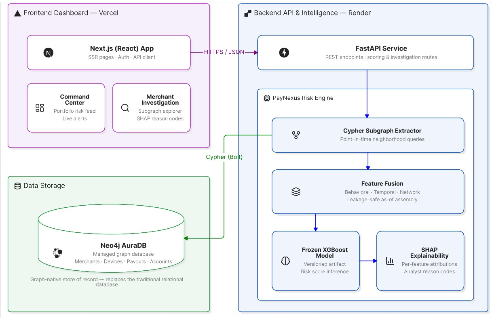

# PayNexus

## Temporal Intelligence for Merchant Mule Networks

> **PayNexus** is the investigator-facing merchant risk intelligence platform.
> **MuleHunter** is the underlying temporal network detection engine.

Together, they detect organized money laundering syndicates and merchant mule networks by analyzing how relationships form over time — not just what they look like today.

---

## 1. The Problem: Merchant Mule Networks

Traditional payment fraud detection focuses on transactional anomalies: stolen credit cards, unusual purchase sizes, account takeover, or chargeback velocity at a single checkout point.

Merchant mule networks represent a fundamentally different organized financial threat:
1. **Apparent Legality**: Individual mule merchants often maintain normal ticket sizes, realistic transaction success rates, verified KYC credentials, and standard merchant categories (grocery, ecommerce, education, etc.).
2. **Syndicate Coordination**: Money laundering syndicates disperse illicit transaction volumes across multiple coordinated shell or rented merchant storefronts to evade velocity triggers and settlement limits.
3. **Hidden Relational Bridges**: Mule rings coordinate through shared physical devices, IP clusters, cyclic customer payment loops, common settlement nodal accounts, and synchronized transaction bursts.
4. **Blind Spot of Isolated Analysis**: When scrutinized in isolation, a mule merchant appears virtually indistinguishable from a legitimate small business. Detection requires analyzing the merchant within the global multi-entity relationship graph.

---

## 2. Why Static Graph Approaches Struggle

Early approaches to mule detection relied on **static graphs** (evaluating the entire history of shared devices and IPs). However, static graphs suffer from two critical flaws:
1. **Structural Leakage**: If a model sees the entire connectivity graph during training, it accidentally learns the "future" topology of test-set networks, artificially inflating recall (e.g., our initial leaked V1 model achieved 100% recall through this flaw).
2. **Operational Realities**: In a production environment, you don't have the final graph—you only have the graph *up to this exact second*.

---

## 3. The MuleHunter Approach: Temporal Network Evolution

> *"A merchant may appear legitimate when analyzed individually, but exhibits mule-like behavior when analyzed as part of a coordinated network involving other merchants, customers, devices, IPs and settlement entities over time."*

MuleHunter shifts from static analysis to **Temporal Network Evolution**. Instead of asking "who is connected to who," it asks "how are these connections forming right now compared to last month?"

It captures this through:
- **Point-in-Time Inference**: Graph state is strictly computed using only historical data prior to the inference date.
- **Behavior + Network Evolution Features**: Combining standard merchant behavioral metrics with network evolution metrics (e.g., 30-day degree velocity, shared infrastructure momentum).

---

## 4. System Architecture



---

## 5. Verified Results (V2 Pipeline)

> [!WARNING]
> **Synthetic Research Notice**: The dataset used for MuleHunter is entirely synthetic and deterministically generated for algorithmic experimentation. It does **not** contain real Razorpay customer or merchant data, and the simulated typologies do not represent production rules.

All metrics are computed on a strictly held-out test set using the frozen MuleHunter V2 model. 

### Final Model Performance (Behavior + Network Evolution)
- **Precision**: 0.782
- **Recall**: 0.865
- **F1 Score**: 0.821
- **ROC-AUC**: 0.974
- **False Positive Rate (FPR)**: 1.5%

### Network / Syndicate Recall
- **Overall Network Recall**: 86.5%
- **Type A (Rapid Formation)**: ~86%
- **Type B (Gradual Expansion)**: 97.4%
- **Type C (Infrastructure Convergence)**: 91.8%

*(Threshold is frozen at **0.3263** for all evaluations.)*

---

## 6. Known Limitations

MuleHunter is highly effective against rapidly forming or infrastructure-heavy syndicates, but struggles with **Type-D (Behavioral Transition)** mules:
- **Type-D Recall**: 65.6%
- **Root Cause**: These syndicates maintain stable infrastructure (no new devices or IPs) and only shift transaction behavior gradually, evading our 30-day delta windows.
- **Mitigation**: The MuleHunter investigator dashboard includes manual network visualization to help human analysts spot these subtler relationships that the automated score misses.

---

## 7. Investigator Dashboard (Demo)

MuleHunter includes a Next.js investigator dashboard powered by a FastAPI backend. It allows analysts to:
1. Search merchants and view their risk score (LOW / MEDIUM / HIGH).
2. Inspect behavioral, network, and temporal evidence.
3. View the temporal evolution timeline of risk.
4. Explore the first-degree connected network to uncover hidden syndicates.

---

## 8. How to Run

### 1. Python Environment & Backend
Ensure you have Python 3.10+ installed.

```bash
# Create and activate virtual environment
python -m venv .venv
source .venv/bin/activate  # On Windows: .venv\Scripts\activate

# Install dependencies
pip install -r requirements.txt

# Start the FastAPI backend
uvicorn src.api.app:app --host 0.0.0.0 --port 8000 --env-file .env
```

### 2. Next.js Dashboard
In a new terminal window:

```bash
cd dashboard
npm install
npm run build
npm run start  # Or npm run dev for development
```
Access the dashboard at `http://localhost:3000`.

### 3. Demo Health Check & Tests
To verify the system is working and the ML pipeline remains intact:

```bash
# Run health check
python src/demo_health_check.py

# Run all 65 automated tests
pytest tests/
```
## 9. Challenges Faced & Solutions

During the development of MuleHunter, several critical roadblocks were encountered and resolved:

1. **Target Leakage in Static Graphs**
   - *Challenge:* Our initial model (V1) achieved an unrealistic 100% recall. Debugging revealed a "leaky" static graph approach: the model was exposed to the entire connectivity graph during training, inadvertently learning the "future" topology of test-set networks.
   - *Solution:* Engineered a strict "Point-in-Time" inference pipeline. We generate temporal snapshots, ensuring the graph state is computed using *only* historical data prior to the inference date, accurately reflecting operational reality.

2. **Differentiating Legitimate Growth from Malicious Network Formation**
   - *Challenge:* Fast-growing legitimate merchants often share infrastructure (e.g., using the same SaaS platforms or aggregators), which triggered false positives in purely structural models.
   - *Solution:* Shifted from static analysis to "Temporal Network Evolution." We combined standard behavioral metrics with network evolution features (like 30-day degree velocity and shared infrastructure momentum). This successfully brought our False Positive Rate down to 1.5%.

3. **Handling Type-D (Behavioral Transition) Mules**
   - *Challenge:* The model struggled (65.6% recall) with syndicates that maintain stable infrastructure but gradually shift their transaction behavior, evading our 30-day delta windows.
   - *Solution:* Acknowledged this limitation for automated detection and built manual network visualization directly into the Next.js investigator dashboard. This empowers human analysts to investigate the broader, long-term relationship graphs.

---
---

## 10. Project Status

- [x] **V2 Dataset**: Temporal network evolution data generation completed.
- [x] **Frozen Model**: Final LightGBM model trained and thresholds frozen.
- [x] **Point-in-Time Inference**: Backend API strictly enforces temporal safety without ground-truth leakage.
- [x] **Investigator Dashboard**: Next.js frontend built and integrated with FastAPI backend.
- [x] **Testing**: 65/65 Python tests passing.
- [x] **Buildathon Ready**: Final documentation and demo health checks verified.
